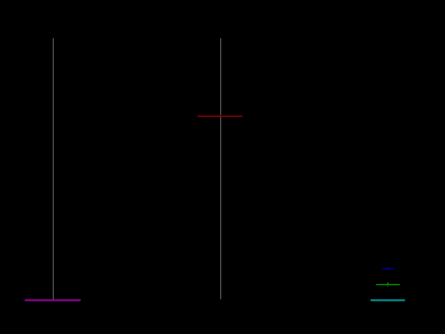

# ugrd-prac

This repo archives coding practices for C, Assembly lanuage and MFC. Most of 
them were games written in my freshman year. I wrote these codes to learn the
languages.

Writing these codes motivated me in my undergraduate studies. At that time, I 
didn't have stackoverflow to quickly search for solutions. I rembered spending
a whole day in the lirary to understand interrupt programming which is needed
for graphics programming in turboc.

These codes were "ugly" (bad coding styles and limited comments). But, it still 
enjoyable to revisit them again to remind me the happiness after a “successful” 
compilation and motivate me to work hard like those old days. These codes will
always have a special place in my heart.

## File Tree
<pre>
|-- hanoi.asm <i>(visualization of hanoi tower solutions)</i>  
|-- snake.c <i>(snake game developed based on Turboc graphic interface)</i>    
|-- tetris.c <i>(tetris game developed based on Turboc graphic interface)</i>  
|-- <b>reversi</b> <i>(reversi implemented in MFC using alpha-beta pruning)</i>  
    |-- <b>release</b>
        ...
        |-- BWview.exe <i>(game exe)</i>  
    |-- <b>src</b> 
        ...
        |-- Bwfind.cpp <i>(Alpha-beta pruning algorithm)</i>
</pre>

## Usage
An exe of reversi is contained in the release folder. Other programs only have
source codes and screenshots.

## Screenshots

## History
Original codes written during 2005 - 2006. No update will be made at this point.